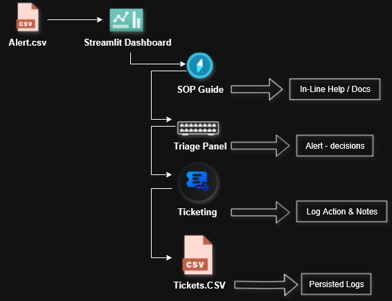

# **SOC-L1 SimLab**

> **Simulate real-world L1 SOC alert triage, ticketing, and response. Build your analyst instincts with practical hands-on workflows.**

## **🚀 Quick Start**

1. **Clone & Install:**
    ```
    git clone https://github.com/yourusername/SOC-L1-SimLab.git
    cd SOC-L1-SimLab
    pip install -r requirements.txt
    ```

2. **Run the App:**
    ```
    streamlit run src/dashboard.py
    ```

3. **Customize Alerts:**  
   Edit or add alerts in `data/alerts.csv` (format provided below).

## **✨ Features**

- **One-by-one alert triage:** Feels like a real SOC queue—handle what pops in, not a giant list dump.
- **Actions:** Escalate, close as false positive, or request more info—each action opens a ticket with your notes.
- **Ticket log:** Every action documented. Go back and review what you did.
- **Built-in SOP cheat sheet:** Get context/recommendations for each alert or action (think “runbook quick reference”).
- **Easy to extend:** Data in CSV, Python code is modular—modify or add your own alert types/features.

**Up Next / Ideas:**
- Gamification (“Nice triage!” or “Hmm, check best practice”)
- Hotkeys for faster analyst flow.
- Analyst stats dashboard (response time, accuracy, etc.)

## 🗺️ Architecture Diagram




## **📄 Sample alerts.csv**
- timestamp,source_ip,event_type,severity,description
```
timestamp,source_ip,event_type,severity,description
2025-07-31 10:00,192.168.1.100,Brute-force,Medium,20+ failed SSH logins in under 2 mins, same source IP
2025-07-31 10:05,10.0.0.5,Port Scan,Low,Scan on ports 22, 80, 3389 flagged by IDS
2025-07-31 10:10,172.16.0.10,Malware Detected,High,AV flagged trojan.gen on user machine – quarantined
2025-07-31 10:15,192.168.1.150,Suspicious Login,Medium,VPN login from Brazil—user usually logs in from Pune
2025-07-31 10:20,203.0.113.25,Phishing Email,High,User clicked link in mail claiming to be from “IT Helpdesk”
2025-07-31 10:25,198.51.100.50,Data Exfiltration Attempt,Critical,Large upload to external IP via HTTP from dev machine
2025-07-31 10:30,10.0.0.10,Privilege Escalation,High,Powershell run with admin rights by non-admin user
2025-07-31 10:35,192.168.1.200,Ransomware Activity,Critical,File renames with .encrypted extension in Documents folder
2025-07-31 10:40,203.0.113.8,Suspicious DNS Query,Medium,Query to known-bad domain (from threat intel list)
2025-07-31 10:45,172.16.0.20,Unauthorized Access,High,RDP login attempt to finance server by disabled account
2025-07-31 10:50,198.51.100.99,Web Shell Detected,High,cmd.php found in webroot, triggered reverse shell pattern
2025-07-31 10:55,192.168.1.105,Malicious Script Execution,Medium,Script started by user from Downloads folder trying outbound request
2025-07-31 11:00,10.0.0.21,Failed MFA Attempt,Medium,Multiple failed MFA attempts from unknown device/IP
2025-07-31 11:05,172.16.0.33,Suspicious Process,Medium,Strange binary running as SYSTEM, unknown hash
2025-07-31 11:10,203.0.113.45,Exploit Attempt,Critical,Alert: CVE exploit attempt against Outlook (port 443)

```
- For more advanced SOC scenarios, just swap the sample with the full assets/alerts.csv file. Contributions for even more alert types are welcome!


## **🛠 Why This Design?**

- **Looks and feels like a real L1 SOC desk:** Fast triage, simple documentation, immediate feedback.
- **CSV for customization:** Swap in your own scenarios, use in demos, or extend with minimal setup.
- **No fluff—just skills:** Focus on decisions, learning, and documentation. The stuff that makes good analysts great.

## **👋 Contributing / License**

> **PRs welcome! Built for learning, training, and interviews. MIT License. **
> **Built for SOC beginners — your feedback and contributions can help make it even better. **


